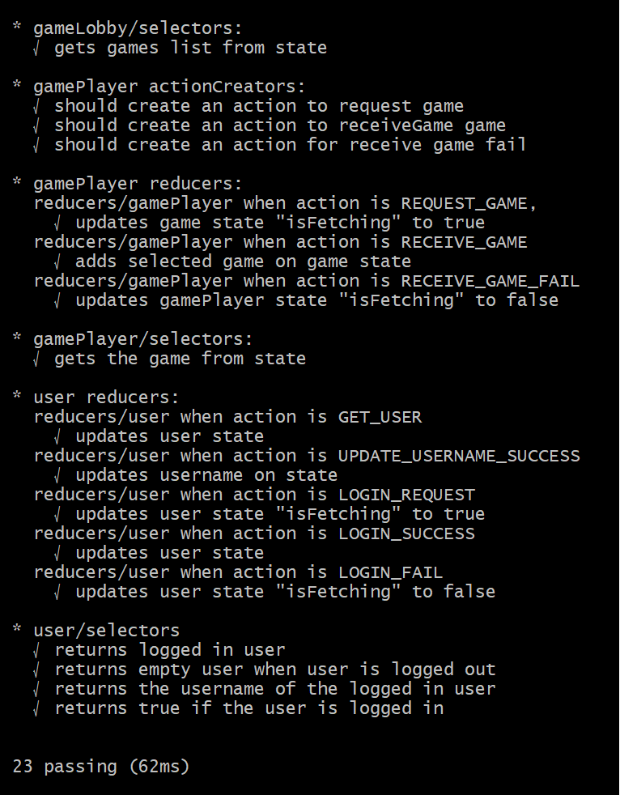
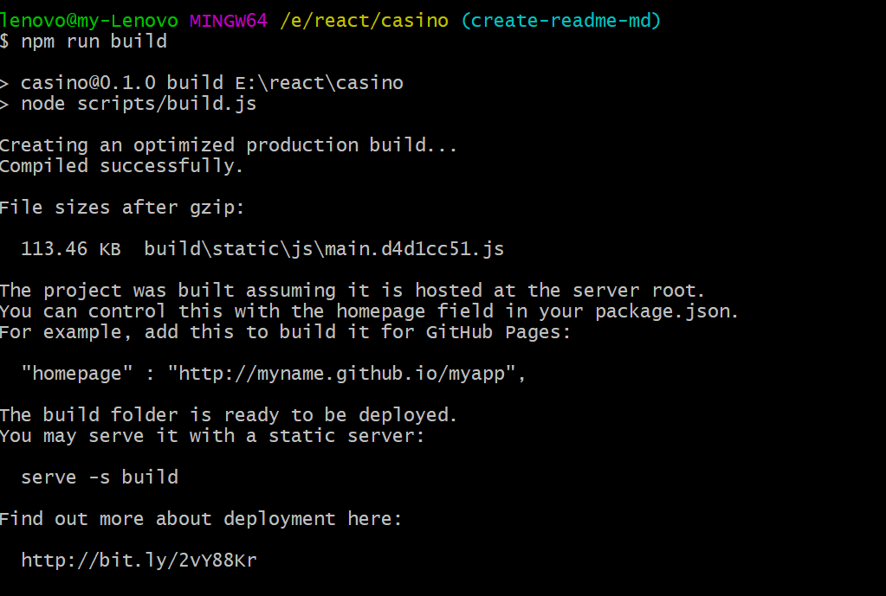
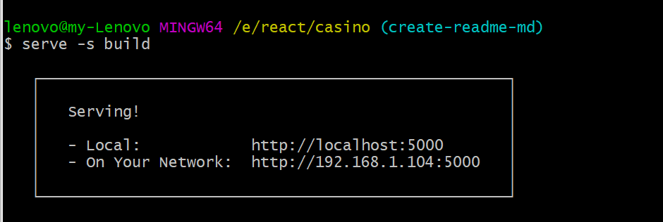

This project was bootstrapped with [Create React App](https://github.com/facebookincubator/create-react-app).


## Table of Contents
- [About](#about)
- [Workflow](#workflow)
- [Technical Workflow](#technical-workflow)
- [Folder Structure](#folder-structure)
- [Run local](#run-local)
- [Available Scripts](#available-scripts)
  - [npm start](#npm-start)
  - [run php local](#run-php-local)
  - [npm test](#npm-test)
  - [npm run build](#npm-run-build)
- [Todo](#todo)


## About
* It is a react + redux web app that fetches async data from an outer server and publish them to the end user.
The end user depending if they are logged in or not, they have access different 
functionalities on the web app. 

* Logged in User:
- Menu:
  - Games  - the list of the games fetched from server
  - username - the user's username
  - Settings - a small form giving the posibility to update the usrname
  - Logout - redirect to /login page

- Functionalities:
  - On 'Games' menu, a request is made to the server and all the available games are shown as cards (image, name, description)
  - A button on each game says 'Play for real'
    - when click 'Play for real', redirect to game/:gameId page, where the end use sees info of the selected game.
    - a close button on gamePlayer redirects the user back to the game lobby.
    - if the game does not exist, a gif is playing and a button 'Sorry! that game no longer exists' shown, that redirect to gameLobby.
  - The logged in user, can see their username, adgacent to 'Games' menu.
  - Settings page, where a form is shown for the logged in user to change the logged in username
    that username, is saved on localStorage only(not on the server).
  - Logout menu, logs out the user , clear the state and the localStorage.

* Logged out user:
- Menu:
  - Games  - the list of the games fetched from server
  - Login  - opens a for that asks username & password.

- Functionalities:
  - On 'Games' menu, a request is made to the server and all the available games are shown as cards (image, name, description)
  - A button on each game says 'Play for fun'
    - when click 'Play for fun', redirect to game/:gameId page, where the end use sees info of the selected game.
    - a button onto the game's image, says 'You need to login to play for real', and on click
    goes to '/login' page.
    - a close button on gamePlayer redirects the user back to the game lobby.
    - if the game does not exist, a gif is playing and a button 'Sorry! that game no longer exists' shown, that redirect to gameLobby.
  - Logout menu, logs out the user , clear the state and the localStorage.

* It is written in reactjs + reduxjs and some other dependencies:
- redux-thunk
- prop-types
- lodash
- sass
- webpack
- bootstrap 4
- jquery
- popper
- mocha
- chai
- babel
- eslint with airbnb

## Workflow

* Init: a request to the API_ENDPOINT: .../dummy-database/games.php, is done to fetch the games data.
* The data are consumed and the store is updated with the games.
* The state looks like this:
  ```
  {
    gamePlayer:{},
    games: {casinoGames:[]},
    user: {},
  }
  ```
* So the user, can navigate through 'Games' & 'Login', at first.
* When he successfully login, one more menu option 'Settings' is added on the navbar.The logged in user can change his usrname.

## Technical Workflow
1. The app loads and the store is created and initialised.
2. All the actions follow this procedure:
 action -> actionCreator -> reducer -> update the state <- selector gets state data -> update the component
2. For style i use bootstrap4 and sass. As for the webpack to convert the scss custom files to css, i added this snipet, on the webpack config file.
  ```
  {
    test: /\.scss$/,
    use: [{
        loader: "style-loader" // creates style nodes from JS strings
    }, {
        loader: "css-loader" // translates CSS into CommonJS
    }, {
        loader: "sass-loader" // compiles Sass to CSS
    }]
  },
  ```
* On folders 'selectos', 'reducers' & 'actionCreators' there are spec files for the unit tests.

A snippet of an actionCreator test :
```
  it('should create an action to receiveGames games ', () => {
    const games = {
      casinoGames: [],
    }
    const expectedAction =
      {
        payload: {
          casinoGames: [],
          isFetching: false,
        },
        type: RECEIVE_GAMES,
      }

    expect(action.receiveGames(games)).eql(expectedAction)
  })
```
A snippet of a selectors test:
```
it('gets the game from state', () => {
    const state =
    {
      gamePlayer: {
        game: {
          gameId: 1,
          gameName: 'Finn',
          gameUrl: 'someurl',
          gameDscription: 'lorem ipsum',
        },
      },
    }
    const result = getGame(state)
    deepFreeze(state)

    expect(result).to.eql({
      gameDscription: 'lorem ipsum',
      gameId: 1,
      gameName: 'Finn',
      gameUrl: 'someurl',
    })
  })
```
A snippet of a reducer test:
```
  describe(`reducers/user when action is ${LOGIN_SUCCESS}`, () => {
    const theUser = { username: 'testuser' }
    const action = {
      payload: {
        ...theUser,
        isFetching: false,
      },
      type: LOGIN_SUCCESS,
    }

    it('updates user state', () => {
      expect(user(undefined, action)).to.eql({
        ...theUser,
        isFetching: false,
      })
    })
  })
```
## Folder structure

I have run `npm run eject`, in order to have better control over, 
webpack, eslint etc.

The structure of the project is this:
```
app/
  config/ <!--webpack config files-->
  node_modules/ <!--dependencies-->
  public/
  scripts/
  src/  <!-- main project code -->
  components/
    button/
      index.js
    footer/
      index.js
    form/
      index.js
    header/
      index.js
    logout/
      actionCreators/
        index.js
        logou.actionCreators.js
      actions/
        index.js
        logout.actions.js
      index.js <!--main component -->
      main/
        index.js
      notification/
        index.js
      root/
        index.js
      css/
        index.scss
      dummy-database/ <!-- this folder must run to a separate php server e.g. apache -->
        /images
        games.php <!-- return array of games-->
        game.php <!-- accepts ?gameId= and returns a game obj-->
        users.php <!-- accepts ?userame='name'&password="pass" and returns a user obj-->
      helpers/
        history.js
      middlewares/
        logger.js <!-- traces actions and state on console -->
      modules/
        gameLobby/
          actionCreators/
            gameLobby.actionCreators.js
            gameLobby.actionCreators.spec.js <!-- unit tests -->
            index.js
          actions/
            index.js
          reducers/
            gameLobby.reducers.spec.js <-- unit tests -->
            gameLobby.reducers.js
            index.js
          selectors/
            gameLobby.selectors.js
            gameLobby.selectors.spec.js <-- unit tests -->
            index.js
          index.js <!-- main module code -->
        gamePlayer/
          actionCreators/
          gamePlayer.actionCreators.js
          gamePlayer.actionCreators.spec.js <!-- unit tests -->
          index.js
        actions/
          index.js
        reducers/
          gamePlayer.reducers.spec.js <-- unit tests -->
          gamePlayer.reducers.js
          index.js
        selectors/
          gamePlayer.selectors.js
          gamePlayer.selectors.spec.js <-- unit tests -->
          index.js
        index.js <!-- main module code -->
        login/
           actionCreators/
            login.actionCreators.js
            index.js
          actions/
            index.js
            login.actions.js
        reducers/
          index.js <!-- root reducer that combines all other reducers -->
        settings/
          index.js
        user/
          actionCreators/
          user.actionCreators.js
          index.js
        actions/
          index.js
          user.actions.js
        reducers/
          user.reducers.spec.js <-- unit tests -->
          user.reducers.js
          index.js
        selectors/
          user.selectors.js
          user.selectors.spec.js <-- unit tests -->
          index.js
      constants.js <!-- constants like messages & url's-->
      index.js
      store.js <!-- projects store-->
      .eslintrc <!-- eslint configuration with rules-->
      package.json
      README.md
```

## Run local

In order to run localhost you shoul:

* download/clone the repo to a folder
* execute npm install to install all the dependencies
* npm run start
* open your browser on http://localhost:3000/

## Available Scripts

In the project directory, you can run:

### `npm start`

Runs the app in the development mode.<br>
Open [http://localhost:3000](http://localhost:3000) to view it in the browser.

The page will reload if you make edits.<br>
You will also see any lint errors in the console.

### `NODE_ENV=development npm run test`

For executing the unit tests we write this script: NODE_ENV=development npm run test
There are currently 23 passed unit tests.


### run php local
Currently the php files: game.php, games.php & users.php are hosted on a temp server and the app works fine. But alternatively, we can hosted them localhost 
by installing apache.But this is beyond this project.

### `npm run build`

By executing `npm run build`, the build folder is creaded and insided the code 
is minified.

We can run the server by executing: `serve -s build`


### `npm run eject`

I have executed this script so, all the hidden files are now visible on the project.
Some useful files are the webpack configuration, which i used to add the 
pre-processor sass.

## Todo

* add more unit tests
* add loader
* add game sorting options
* change php with [json-server]: https://github.com/typicode/json-server
For having js code on front end and backend
